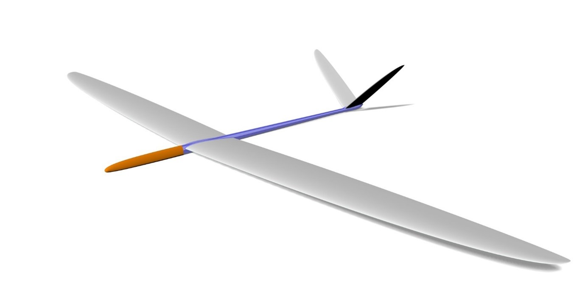
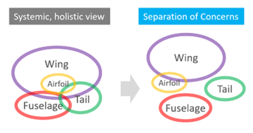
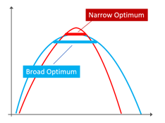
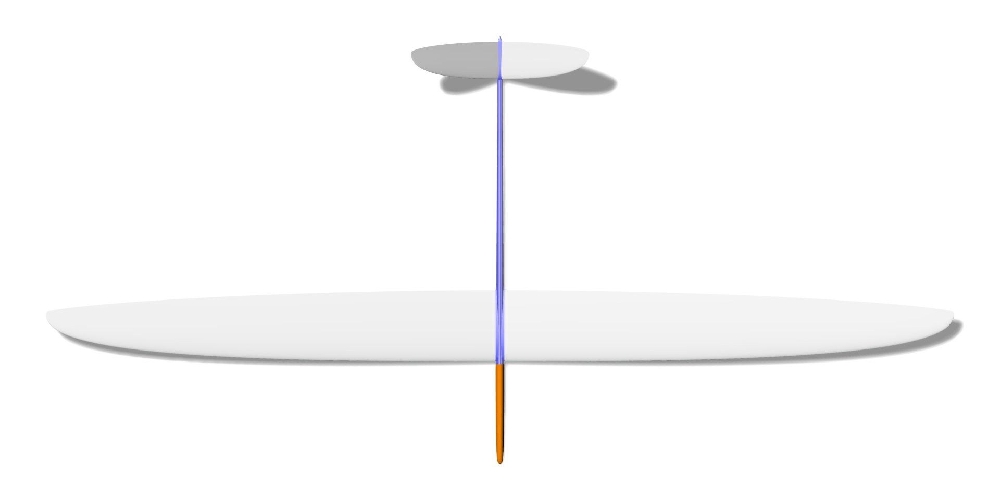

# Project V-JX
A fast glider for slopes and F3F competition. 

V-JX is a common project of Jochen Guenzel and Mario Perner where Jochen focuses on aerodynamic design and Mario on engineering and building of the model. 

Within this repository, we want to make a "full stack description" - i.e. from the aerodynamic design to the final build out of molds. As far as possible, we will make the calculations and plans available "open source" and thus also invite to a lively discussion, in which we all will hopefully be a bit smarter in the end.

## Chapters

### [Preliminary remarks on the procedure](#preliminary-remarks-on-the-procedure)
### Wing
* [Design - Airfoil sections, planform, control surfaces](wing/design/wing_design_1.md) 
* Build - CAD, molds and carbon fiber build
###	Tail
* [Design - Airfoil sections, planform, ruddervator](tail/tail_design.md) 
* Build - CAD, molds and carbon fiber build
### Fuselage 
* Design - Outline 
* Build - CAD, molds and carbon fiber build

### .

## Preliminary remarks on the procedure

The approach with V-JX is somehow atypical for the design of a new model. 

It all started with the [JX-GS airfoil family](https://github.com/jxjo/Airfoils/tree/main/JX-GS)   , which was developed specifically for F3F, but was not based on a specific model design.  In the course of time, however, thoughts matured as to what an optimal wing for this airfoil family should look like.  Which eventually resulted in a first wing design. 

Since a "proof of concept" of this wing design should be carried out as early as possible, the complete design of a new model was out of the question.   With a "test vehicle", the new wing should be put into the air as quickly as possible in order to test its performance. 

We opted for the ["Vantage"](https://ccm.in.ua/en/catalog/r-c-models/vantage/), Mario's current design for F3F/F3B.

The Vantage has perfect dimensions of a current F3F model, which makes the fuselage and tail very well suited to be equipped with a new wing module to evaluate the characteristics of V-JX - also in comparison. 

In the development of a new plane, such a separate consideration of the individual components wing, tail and fuselage can be dangerous. The mutual interaction is too complex to achieve an optimized overall design. On the other hand, over the past 30 years, with countless great designs, a narrow design corridor has emerged as to what an optimal model for the F3F flight task should look like. 

Even if it may not be possible to achieve the last bit of improvement by looking at the main components separately, the procedure in the sense of "separation of concerns" of the individual components simplifies the overall development immensely.  As long as you move in the described design corridor, the probability of a "wrong design" is relatively low...

A further aspect or guideline for the aerodynamic design, including the profile structure, was: Wherever possible and sensible, a more defensive solution with a "wide optimum" was given preference over exhaustion in a narrow area. 

The danger of not hitting the "sweet spot" of a narrow optimum under competition flight conditions and thus having to accept significant performance losses far outweighs the prospect of minimal profits compared to a solution with a broad optimum.   

### Design Goals of V-JX

"Pretty daring" you could say. To get involved in the round of excellent and mature F3F models such as the Freestylers, Pitbulls, Shintos, Vantage and the numerous other top models. To be even "better" in the end!

The key is certainly that there can no longer be a one-dimensional "better" in the current top models. Each model is practically unbeatable on its own. 

The difference lies in the specific characteristics of the models, which in their sum are decisive for whether a pilot controls an "optimal sports device" for him under certain conditions.

The property profile  of V-JX has been defined as follows with a comparative classification between o (=weak) and ooooo (=top).

|  Aspect                     | Score   |
|-----------------------------|---------|
| Speed range in F3F times    |         |
| ... over 50s			      |ooo     | 
| ... 40s – 50s			      |oooo    |
| ... below 40s			      |ooooo   |
| Acceleration				  |ooooo   |
| Minimum curve radius		  |ooo     |
| Speed in turn				  |ooooo   |
| Manoeuvrability 			  |ooooo   |
| Flight stability			  |oooo    |
| Good-naturedness 			  |ooooo   |

Or more colloquially: "With good lift on the slope, it should be a fast, agile at the same time good-natured rocket ...".

The goal was set.  Now it's time to work!  😉
We'll start with the [wing design...](wing/design/wing_design_1.md) 

## Acknowledgements 

What would we do without great persons and their awesome contributions?
-	Mark Drela - xfoil
-	André Deperrois - Xflr5
-	Frank Ranis - FLZ_vortex 
-	Daniel Prosser -  Xoptfoil
-	and many others... 

A special thank you to my patient punching partners Tobias Schill, Peter Wick, Matthias Boese.

Have Fun!

Jochen Guenzel & Mario Perner 

## Project History 
- 2021 - June: Projet start 
- 2021 - October: First prototype wing with vantage fuselage abd tail 
- 2022 - April: Flight evaluations started (brought some delay) 
- 2022 - July: Restart of flight evaluations with Tobis Reik and Thorsten Folkers
- 2022 - September: First F3F contest participation in Denmark / Sealand
- 2023 - October: F3F WC - serveral rounds fown by Thorsten Fokers
